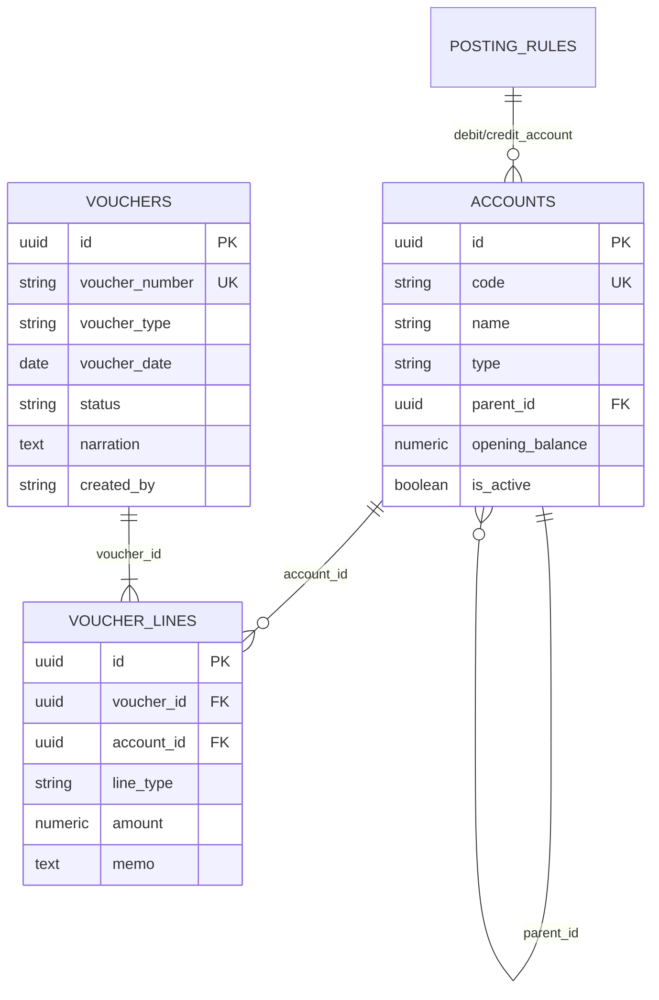
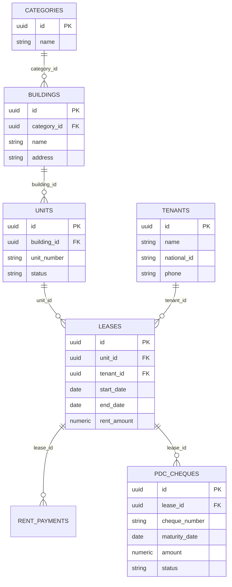

# InsAcc Database Design Specification

**Document ID:** DATABASE_DESIGN_SPECIFICATION.md  
**Version:** 1.0.0  
**Status:** Official Database Design Specification  
**Release Date:** 2026-07-22  
**Target Software:** InsAcc Enterprise Asset & Investment Accounting Platform v1.0.0  
**Single Source of Truth Reference:** [MASTER_ARCHITECTURE.md](file:///Users/t6ux/InsAcc/docs/MASTER_ARCHITECTURE.md)

---

> [!IMPORTANT]
> **GOVERNANCE DIRECTIVE**: InsAcc v1.0.0 persists operational data locally using HTML5 `localStorage` across 16 storage keys. All relational SQL schemas, PostgreSQL tables, DDL triggers, views, and functions documented herein represent the **Planned Target Enterprise Architecture [Planned]** for server release v2.0.0.

---

## Table of Contents

1. [Database Architecture & Overview](#1-database-architecture--overview)
2. [Current LocalStorage Data Key Schema (v1.0.0)](#2-current-localstorage-data-key-schema-v100)
3. [Naming & Data Type Standards](#3-naming--data-type-standards)
4. [Planned PostgreSQL Relational ER Diagrams](#4-planned-postgresql-relational-er-diagrams)
5. [Accounting Schema Specification [Planned]](#5-accounting-schema-specification-planned)
6. [Investment Schema Specification [Planned]](#6-investment-schema-specification-planned)
7. [Property Schema Specification [Planned]](#7-property-schema-specification-planned)
8. [User & Auth Schema Specification [Planned]](#8-user--auth-schema-specification-planned)
9. [Audit & System Settings Schema Specification [Planned]](#9-audit--system-settings-schema-specification-planned)
10. [Database Triggers, Functions & Views [Planned]](#10-database-triggers-functions--views-planned)
11. [Migration Strategy (LocalStorage to PostgreSQL)](#11-migration-strategy-localstorage-to-postgresql)

---

## 1. Database Architecture & Overview

InsAcc manages financial assets, double-entry general ledger vouchers, property real estate units, tenant contracts, and bank transactions. 

### Dual Architecture Paradigm
- **Current v1.0.0 State**: Local-first `localStorage` JSON document storage with schema versioning (`CLEAR_VERSION = 8`).
- **Target Enterprise State [Planned]**: Multi-tenant PostgreSQL 17 relational database split into 5 logical schemas (`accounting`, `investment`, `property`, `auth`, `audit`).

---

## 2. Current LocalStorage Data Key Schema (v1.0.0)

The v1.0.0 desktop distribution uses **16 primary key-value storage collections**:

| Key Name | TypeScript Model Type | Primary Key Identifier | Description |
|---|---|---|---|
| `insacc_investments` | `Investment[]` | `id` (UUID / String) | Active portfolio holdings and asset positions. |
| `insacc_transactions` | `Transaction[]` | `id` (UUID / String) | Income, expense, and general journal records. |
| `insacc_statement` | `StatementEntry[]` | Array Index / `id` | Legacy bank statement entries. |
| `insacc_balance` | `number` | N/A | Legacy bank balance scalar (Deprecated). |
| `insacc_documents` | `DocItem[]` | `id` (UUID) | Document metadata and Base64 file attachments. |
| `insacc_logs` | `LogEntry[]` | `id` (UUID) | System operational audit logs. |
| `insacc_purchase_categories` | `PurchaseCategory[]` | `id` (UUID) | Purchase ledger category taxonomy. |
| `insacc_purchases` | `Purchase[]` | `id` (`P-timestamp-N`) | Individual purchase ledger asset transactions. |
| `insacc_inv_users` | `UserEntry[]` | `id` (UUID) | Investment module user profile credentials. |
| `insacc_prop_users` | `UserEntry[]` | `id` (UUID) | Property module user profile credentials. |
| `insacc_prop_categories` | `PropertyCategory[]` | `id` (UUID) | Property category classifications. |
| `insacc_prop_buildings` | `PropertyBuilding[]` | `id` (UUID) | Building master records per category. |
| `insacc_prop_units` | `PropertyUnit[]` | `id` (UUID) | Rentable units within buildings. |
| `insacc_prop_tenants` | `PropertyTenant[]` | `id` (UUID) | Tenant master records and active lease terms. |
| `insacc_prop_rent` | `RentPayment[]` | `id` (UUID) | Per-unit rent collection payment records. |
| `insacc_clear_version` | `string` | N/A | Schema version tracking (`CLEAR_VERSION = '8'`). |

---

## 3. Naming & Data Type Standards

### 3.1 SQL Naming Rules [Planned]
- **Schemas**: `snake_case` (e.g., `accounting`, `property`).
- **Tables**: `snake_case` plural nouns (e.g., `accounts`, `voucher_lines`, `leases`).
- **Columns**: `snake_case` (e.g., `voucher_number`, `opening_balance`, `created_at`).
- **Primary Keys**: `id` UUID type generated via `gen_random_uuid()`.
- **Foreign Keys**: `<singular_table_name>_id` (e.g., `account_id`, `tenant_id`).
- **Indexes**: `idx_<table_name>_<column_name>` (e.g., `idx_vouchers_status`).
- **Triggers**: `trg_<table_name>_<action>` (e.g., `trg_vouchers_updated_at`).

### 3.2 Monetary & Precision Rules
- **Monetary Amounts**: `NUMERIC(15, 2)` (Supports up to 999 trillion with 2 decimal places).
- **Asset Quantities**: `NUMERIC(18, 6)` (Supports fractional holdings such as 0.000001 gold grams or crypto lots).
- **Timestamps**: `TIMESTAMPTZ` (ISO 8601 with UTC offset).

---

## 4. Planned PostgreSQL Relational ER Diagrams

### 4.1 General Ledger & Accounting ERD [Planned]



### 4.2 Property Management ERD [Planned]



---

## 5. Accounting Schema Specification [Planned]

### Schema: `accounting`

#### Table: `accounting.accounts`
- **Purpose**: Stores system and user-defined Chart of Accounts nodes.
- **Primary Key**: `id` UUID.

| Column Name | Data Type | Nullable | Constraints | Description |
|---|---|---|---|---|
| `id` | UUID | No | PRIMARY KEY | Immutable unique identifier. |
| `code` | VARCHAR(20) | No | UNIQUE | Account code (e.g., `1110`, `1120.001`). |
| `name` | VARCHAR(255) | No | — | Account description. |
| `type` | VARCHAR(50) | No | CHECK | `Asset`, `Liability`, `Equity`, `Revenue`, `Expense`. |
| `parent_id` | UUID | Yes | FK -> `accounts(id)` | Parent account node ID. |
| `opening_balance` | NUMERIC(15,2)| No | DEFAULT 0.00 | Initial opening balance baseline. |
| `is_active` | BOOLEAN | No | DEFAULT TRUE | Active status flag. |
| `created_at` | TIMESTAMPTZ | No | DEFAULT NOW() | System creation timestamp. |

#### Table: `accounting.vouchers`
- **Purpose**: Master record for double-entry vouchers (`RV`, `PV`, `JV`).

| Column Name | Data Type | Nullable | Constraints | Description |
|---|---|---|---|---|
| `id` | UUID | No | PRIMARY KEY | Unique voucher identifier. |
| `voucher_number` | VARCHAR(50) | No | UNIQUE | Numbering sequence (e.g., `RV-2026-0001`). |
| `voucher_type` | VARCHAR(20) | No | CHECK | `Receipt`, `Payment`, `Journal`. |
| `voucher_date` | DATE | No | — | Economic transaction date. |
| `status` | VARCHAR(20) | No | CHECK | `Draft`, `Approved`, `Posted`, `Cancelled`, `Reversed`. |
| `narration` | TEXT | Yes | — | Master voucher description. |
| `created_by` | VARCHAR(100) | No | — | User ID of creator. |
| `posted_at` | TIMESTAMPTZ | Yes | — | Timestamp of general ledger posting. |

#### Table: `accounting.voucher_lines`
- **Purpose**: Detail debit and credit lines for each voucher.

| Column Name | Data Type | Nullable | Constraints | Description |
|---|---|---|---|---|
| `id` | UUID | No | PRIMARY KEY | Line item identifier. |
| `voucher_id` | UUID | No | FK -> `vouchers(id)` | Foreign key to parent voucher. |
| `account_id` | UUID | No | FK -> `accounts(id)` | Foreign key to general ledger account. |
| `line_type` | VARCHAR(10) | No | CHECK | `Debit` or `Credit`. |
| `amount` | NUMERIC(15,2)| No | CHECK > 0 | Line transaction amount. |
| `memo` | TEXT | Yes | — | Line item descriptive memo. |

---

## 6. Investment Schema Specification [Planned]

### Schema: `investment`

#### Table: `investment.investments`
- **Purpose**: Master holdings position table.

| Column Name | Data Type | Nullable | Constraints | Description |
|---|---|---|---|---|
| `id` | UUID | No | PRIMARY KEY | Investment position ID. |
| `asset_name` | VARCHAR(255) | No | — | Asset title (e.g. `24K Gold Bar 1kg`). |
| `asset_type` | VARCHAR(50) | No | — | `Gold`, `Silver`, `Stocks`, `Bonds`, `ETFs`. |
| `quantity` | NUMERIC(18,6)| No | CHECK >= 0 | Total units owned. |
| `purchase_value` | NUMERIC(15,2)| No | CHECK >= 0 | Historical cost basis. |
| `current_price` | NUMERIC(15,2)| No | CHECK >= 0 | Current market price per unit. |

---

## 7. Property Schema Specification [Planned]

### Schema: `property`

#### Table: `property.pdc_cheques`
- **Purpose**: Post-Dated Cheque state tracking.

| Column Name | Data Type | Nullable | Constraints | Description |
|---|---|---|---|---|
| `id` | UUID | No | PRIMARY KEY | Cheque identifier. |
| `lease_id` | UUID | No | FK -> `leases(id)` | Foreign key to tenant lease contract. |
| `cheque_number` | VARCHAR(50) | No | — | Physical cheque leaf number. |
| `bank_name` | VARCHAR(100) | No | — | Drawee bank name. |
| `maturity_date` | DATE | No | — | Cheque maturity date. |
| `amount` | NUMERIC(15,2)| No | CHECK > 0 | Cheque face value. |
| `status` | VARCHAR(20) | No | CHECK | `Received`, `Deposited`, `Cleared`, `Bounced`, `Replaced`, `Cancelled`. |

---

## 8. User & Auth Schema Specification [Planned]

### Schema: `auth`

#### Table: `auth.users`
- **Purpose**: System user profiles and authentication.

| Column Name | Data Type | Nullable | Constraints | Description |
|---|---|---|---|---|
| `id` | UUID | No | PRIMARY KEY | User identifier. |
| `email` | VARCHAR(255) | No | UNIQUE | User login email address. |
| `password_hash` | VARCHAR(255) | No | — | Salted password hash (Argon2 / bcrypt). |
| `role` | VARCHAR(20) | No | CHECK | `Admin` or `Accounts`. |
| `is_active` | BOOLEAN | No | DEFAULT TRUE | Active user status. |

---

## 9. Audit & System Settings Schema Specification [Planned]

### Schema: `audit`

#### Table: `audit.events`
- **Purpose**: Complete system operational audit trail.

| Column Name | Data Type | Nullable | Constraints | Description |
|---|---|---|---|---|
| `id` | UUID | No | PRIMARY KEY | Audit log entry ID. |
| `user_id` | UUID | Yes | FK -> `users(id)` | User executing action. |
| `event_type` | VARCHAR(100) | No | — | Action descriptor (e.g. `VOUCHER_POSTED`). |
| `payload` | JSONB | No | — | Complete state snapshot before/after action. |
| `created_at` | TIMESTAMPTZ | No | DEFAULT NOW() | System log timestamp. |

---

## 10. Database Triggers, Functions & Views [Planned]

### 10.1 Double-Entry Balance Validator Trigger Function [Planned]
```sql
CREATE OR REPLACE FUNCTION accounting.fn_validate_voucher_balance()
RETURNS TRIGGER AS $$
DECLARE
    v_debit_sum NUMERIC(15,2);
    v_credit_sum NUMERIC(15,2);
BEGIN
    SELECT COALESCE(SUM(amount), 0) INTO v_debit_sum 
    FROM accounting.voucher_lines 
    WHERE voucher_id = NEW.id AND line_type = 'Debit';

    SELECT COALESCE(SUM(amount), 0) INTO v_credit_sum 
    FROM accounting.voucher_lines 
    WHERE voucher_id = NEW.id AND line_type = 'Credit';

    IF ABS(v_debit_sum - v_credit_sum) > 0.001 THEN
        RAISE EXCEPTION 'Voucher % is unbalanced! Total Debits (%) != Total Credits (%)', 
            NEW.voucher_number, v_debit_sum, v_credit_sum;
    END IF;

    RETURN NEW;
END;
$$ LANGUAGE plpgsql;

CREATE TRIGGER trg_validate_voucher_posting
BEFORE UPDATE OF status ON accounting.vouchers
FOR EACH ROW
WHEN (NEW.status = 'Posted')
EXECUTE FUNCTION accounting.fn_validate_voucher_balance();
```

---

## 11. Migration Strategy (LocalStorage to PostgreSQL)

To migrate an active workstation from `localStorage` to PostgreSQL 17:

1. **State Export**: Administrator exports state snapshot via `Settings` -> `Export JSON State`.
2. **Database Initialization**: Run `scripts/postgresql/init-database.sh`.
3. **ETL Ingestion**: Node.js ingestion script converts JSON objects to SQL `INSERT` statements using parameterized transactions.
4. **Validation Check**: Asserts that:
   $$\sum \text{PostgreSQL General Ledger Debits} = \sum \text{LocalStorage Ledger Debits}$$

---

*End of Database Design Specification.*
