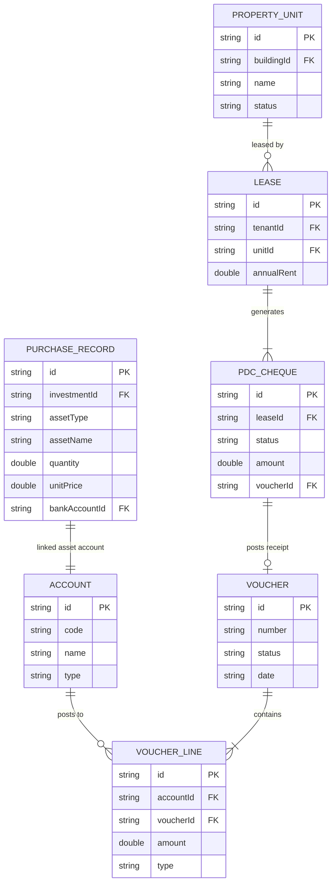

# InsAcc ERP Master Specification
**The Definitive Architecture, Design, and Business Logic Manual**
*Version 1.0.0 — July 2026*

---

## 1. Vision

InsAcc (Intelligent Asset & Investment Accounting) is a premium, desktop-only, offline-first enterprise resource planning (ERP) platform for tracking complex investment portfolios and physical property assets. 

It is designed for professional wealth managers, family offices, and asset management firms who require complete operational privacy, zero server dependency, and institutional-grade financial integrity.

---

## 2. Business Goals

*   **Audit-Grade Integrity:** Every transaction, purchase, or lease operation must reconcile completely against a write-side double-entry ledger.
*   **Privacy & Data Ownership:** Zero cloud infrastructure. The data must remain entirely under the client's physical possession.
*   **Operational Simplicity:** A zero-install configuration model where the entire software runs within a lightweight portable desktop container, retaining maximum performance.
*   **Unified Accounting Core:** Decouple portfolio views and tenant contracts from ledger reporting, while ensuring all operational commands post correct journal entries.

---

## 3. Client Requirements

1.  **Desktop Containerization:** Support cross-platform installations (Windows, macOS, Linux) with native file dialogues and printing options.
2.  **No Cloud Infrastructure:** Must execute entirely offline, using the client machine's browser sandbox for data storage and execution.
3.  **High-Performance Aggregations:** Instantly generate balances, yields, occupancy matrices, and multi-year reports from raw transactional journals.
4.  **Local Encryption & Access Control:** Support localized pin/password access gates and define operational profiles (Admin vs. Accounts).

---

## 4. Investment Module

The Investment Module is a purchase-based asset tracking engine. It records cost-basis lots, tracks values, and establishes bank ledger connections for every purchase.

### 4.1 Asset Classes Supported
*   **Precious Metals:** Gold, Silver (measured in weight and purity).
*   **Equities & Derivatives:** Stocks, Exchange Traded Funds (ETFs), Mutual Funds (measured in share units).
*   **Fixed Income:** Corporate and Government Bonds (measured in face value).
*   **Alternative Assets:** Cryptocurrencies, Real Estate holdings.

### 4.2 Core Workflows
*   **Purchase Ledger Recording:** Creates a lot entry capturing purchase date, quantity, price per unit, buyer fees, and the funding bank account.
*   **Asset Aggregations:** Computes total holdings value based on manual revaluations or market-price updates.
*   **Reconciliation:** Traces funding flow back to specific bank ledgers, preventing asset creation without cash displacement.

---

## 5. Property Module

The Property Module is an income-based management system focusing on rental assets, lease contracts, and collection schedules.

### 5.1 Organizational Hierarchy
```
Main Category (e.g., Residential, Commercial)
  └── Property (e.g., Al Hamra Building, Downtown Villa)
        └── Income Category (e.g., Penthouse, Retail Shop)
              └── Customer (Tenant Details)
                    └── Lease (Contracts, Deposits, Payment Frequencies)
                          └── Rent Collection (PDC Cheques, Receipts)
```

### 5.2 Lease & PDC Lifecycle
1.  **Lease Creation:** Defines start/end dates, security deposit amount, and annual rent.
2.  **PDC Generation:** Automatically generates post-dated cheque schedules (e.g., 4, 6, or 12 cheques) mapping to specific due dates.
3.  **Collection Lifecycle:**
    *   `Pending`: Held in safe vault.
    *   `Deposited`: Sent to bank collection clearance.
    *   `Cleared`: Confirmed in bank balance (posts Debit Cash / Credit PDC Asset).
    *   `Bounced`: Returned unpaid (posts Debit Receivables / Credit PDC Asset).
    *   `Replaced` / `Cancelled`: Swapped out for cash or alternative cheques.

---

## 6. Accounting Module

Accounting is the underlying core of the system. All operational screens act as wrappers that generate journal postings to this engine.

### 6.1 Voucher Types
*   **Receipt Voucher:** Records incoming funds (Debit Bank/Cash, Credit Revenue/Receivables).
*   **Payment Voucher:** Records outgoing funds (Debit Expense/Assets, Credit Bank/Cash).
*   **Journal Voucher:** Reclassifications and adjustments (balanced Debit/Credit sets).
*   **Contra Voucher:** Inter-bank transfers and cash allocations (Debit Bank A, Credit Bank B).
*   **Purchase Voucher:** Asset cost bookings (future capability).
*   **Sales Voucher:** Disposals and revenues (future capability).

### 6.2 Chart of Accounts (COA) Structure
```
1000-1999: Assets
  ├── 1110: Cash In Hand
  ├── 1120: Bank Accounts
  ├── 1320: Rental Receivables
  └── 1410: Post-Dated Cheques (PDC) Asset
2000-2999: Liabilities
  ├── 2100: Accounts Payable
  └── 2120: Security Deposits Held
3000-3999: Equity
  ├── 3100: Capital Contribution
  └── 3200: Retained Earnings
4000-4999: Revenue
  ├── 4110: Dividend Income
  └── 4120: Rental Income
5000-5999: Expense
  ├── 5120: Property Maintenance
  └── 5230: Administrative Salaries
```

---

## 7. Data Relationships

The database relies on logical relational links tracked via unique IDs rather than names.



---

## 8. UI Standards

The visual design system is designed to look premium, modern, and trustworthy.

*   **Design Tokens:** Handled via CSS Custom Properties in [theme.css](file:///Users/t6ux/InsAcc/src/renderer/styles/theme.css).
*   **Typography:** The **Inter** font family is bundled locally (zero external CDN requests). Spacing uses a strict 4px grid.
*   **Color Theme Classes:** Light mode is default. Dark mode is initiated by appending `.dark-mode` to the root HTML node.
*   **Visual Elements:**
    *   **Buttons:** Standardized heights (26px small, 34px default, 40px large).
    *   **Cards:** Rounded corners (16px border-radius) with soft shadow profiles.
    *   **Modals:** Displayed with standard scale animations and a backdrop blur filter.
    *   **Icons:** Scalable SVG components defined directly in [DesignSystem.tsx](file:///Users/t6ux/InsAcc/src/renderer/components/design/DesignSystem.tsx).

---

## 9. Coding Standards

*   **TypeScript Configuration:** Compiles under strict mode. The `any` type is forbidden.
*   **Component Structure:** Focus on functional, reusable component composition. Shared page structures must pull from `components/design/`.
*   **Data Immutability:** Never modify props or state directly. Use deep copies or immutable update patterns.
*   **Code Integrity:** Remove unused packages, dead functions, and console statements before deployment.

---

## 10. System Architecture

InsAcc runs inside an Electron shell that coordinates window management and files.

```
┌─────────────────────────────────────────────────────────┐
│                     Electron Shell                      │
│  ┌───────────────────────────────────────────────────┐  │
│  │               React UI Layer (Vite)               │  │
│  │   Components ➔ useMemo Projections ➔ UI Render    │  │
│  └─────────────────────────┬─────────────────────────┘  │
│                            │ (Read/Write States)        │
│                            ▼                            │
│  ┌───────────────────────────────────────────────────┐  │
│  │                localStorage Layer                 │  │
│  │           Key Prefix: insacc_                     │  │
│  └─────────────────────────┬─────────────────────────┘  │
│                            │ (IPC Bridge Calls)         │
│                            ▼                            │
│  ┌───────────────────────────────────────────────────┐  │
│  │                 Preload Bridge                    │  │
│  │          Exposes api.saveFile/writeFile           │  │
│  └─────────────────────────┬─────────────────────────┘  │
└────────────────────────────┼────────────────────────────┘
                             ▼
                    [Operating System]
                    Filesystem Writes / PDF Generation
```

---

## 11. Read Models (Queries)

Projections are computed on the fly using React's `useMemo` hooks over the source tables, ensuring high performance.

*   **`InvestmentDashboardReadModel`:** Computes net worth, cash allocations, and portfolio growth timelines.
*   **`InvestmentHoldingsReadModel`:** Aggregates costs, weights, and unrealized gains across purchases.
*   **`InvestmentReportsReadModel`:** Computes bank statement reconciliations and transactional reports.
*   **`PropertyFinancialStatements`:** Computes trial balances, profit & loss tables, and balance sheets dynamically.

---

## 12. Write Models (Commands)

State writes represent transactional operations stored as JSON tables inside `localStorage`.

*   `insacc_vouchers`: Core double-entry journals.
*   `insacc_accounts`: Ledger chart definitions.
*   `insacc_purchases_ledger`: Individual asset purchase lots.
*   `insacc_prop_leases`: Tenant leasing contracts.
*   `insacc_pdc_cheques`: Collection schedules for cheques.

---

## 13. Security

*   **Context Isolation:** Electron operates with `contextIsolation: true` and `nodeIntegration: false`. The web renderer cannot access Node.js modules directly.
*   **Plaintext Gates:** Credentials are checked against a localized setting (`insacc_password`). There is no online hashing database.
*   **Role-Based Scope:** Hides user control settings and database purge tools for profiles with an `Accounts` role.

---

## 14. Future Roadmap

*   **Target v2.0 Design System:** Move to modern typography alignments and standardized grid structures.
*   **Multi-Currency Support:** Support transactional conversions based on historical rates.
*   **Tax-Lot Tracking (FIFO/LIFO):** Implement automated queue selectors for tracking capital gains.
*   **Asset Disposals:** Add native capital gains calculations during asset sales.

---

## 15. Business Rules

### 15.1 Investment Rules
*   **Cash Validation:** Every asset purchase must decrease bank cash balance through a posted voucher entry.
*   **Weighted Cost Average:** Simple averages are forbidden. Valuation must use:
    $$\text{Average Price} = \frac{\sum (\text{Quantity} \times \text{Unit Price})}{\sum \text{Quantity}}$$

### 15.2 Property Rules
*   **PDC Replacement:** Replacing a cheque cancels the old item (`Replaced`) and creates a new `Pending` cheque, updating the reference logs.
*   **Operational Decoupling:** Property workflows track income and lease dates, while Investment workflows track purchasing capital. Their views and data stores must never overlap.

---

## 16. Naming Conventions

*   **React Components:** PascalCase matching the exported name (e.g., `InvestmentDashboard.tsx`).
*   **Hooks:** camelCase prefixed with `use` (e.g., `usePersistedState.ts`).
*   **Types & Interfaces:** PascalCase (e.g., `Account`, `VoucherLine`).
*   **Folders:** All lowercase (e.g., `accounting`, `readmodels`).

---

## 17. Folder Structure

```
src/
├── main/                       # Electron main thread
└── renderer/                   # React GUI application
    ├── index.tsx               # Entry mount
    ├── App.tsx                 # Core states and routing
    ├── accounting/             # Double-entry ledger logic
    ├── components/             # Reusable UI elements
    ├── data/                   # Types and seed structures
    ├── readModels/             # Projection queries
    ├── services/               # System business rules
    └── styles/                 # Theme Custom Properties
```

---

## 18. Completed Features

*   **Double-Entry Core Engine:** Voucher ledger posting and validations.
*   **Financial Disclosures:** Auto-balancing Trial Balance, Balance Sheet, and P&L.
*   **Property Occupancy Engine:** Properties, units, tenants, and lease creation.
*   **PDC Collection Pipeline:** Cheque status updates and voucher links.
*   **Reports Export:** Local PDF, CSV, and Excel document saves.

---

## 19. Pending Features

*   **FIFO/LIFO Cost Matching:** Automated lot queues for disposals.
*   **System Attachments:** base64 scanning for receipts and leases.
*   **Multi-Currency Transactions:** Conversions and foreign exchange adjustments.

---

## 20. Known Limitations

*   **Storage Limits:** Browser `localStorage` is restricted to ~5MB.
*   **Local Password Storage:** Passwords are saved in plain text, making them suitable only for local desktop environments.
*   **No Multi-User Sync:** Single-instance execution only; no cloud sync capabilities.

---

## 21. Testing Standards

*   **Testing Tool:** Playwright E2E suites.
*   **Requirement:** Tests run locally against the Vite dev server. They must pass successfully without warnings before delivery.

---

## 22. ERP Principles

*   **Traceability:** Every ledger record must link back to a transaction source.
*   **Relational Integrity:** No orphaned entries are allowed; deletions must handle dependencies.
*   **Auditable Ledger:** Posted journals are immutable. Changes require reversal adjustments.

---

## 23. Financial Principles

*   **Double-Entry Rules:** Every Debit transaction must match a Credit transaction.
*   **Normal Balances:** Accounts must conform to their natural balances (Assets/Expenses are Debit, Liabilities/Equity/Revenue are Credit).
*   **Accruals Concept:** Transactions must be booked in the periods they occur, independent of physical payment receipt.

---

## 24. Performance Standards

*   **Component Optimization:** Keep state updates minimal; prevent unnecessary rerenders.
*   **Computed Projections:** Run expensive calculations in `useMemo` hooks.
*   **Graphic Optimization:** Use lightweight SVGs; do not include heavy external images or font frameworks.

---

## 25. AI Development Rules

*   **Strict Verification:** Confirm TypeScript and build execution pass after modifications.
*   **No Unrelated Modifications:** Work strictly within the requested code file boundaries.
*   **Documentation Integrity:** Preserve file headings, comments, and typing structures.

---

## 26. Complete Business Workflows

### 26.1 Investment Purchase Workflow
The investment flow tracks transaction-based asset purchases. The objective is to convert bank cash reserves into registered investment holdings:
1.  **Form Input:** The user navigates to the *Purchase Ledger* screen and submits details for a new purchase: asset name, asset class, purchase date, unit quantity, unit price, buyer name, funding bank account ID, and tags.
2.  **Sanitization and Validation:**
    *   Ensures that quantity and unit price are strictly positive (> 0).
    *   Retrieves the target bank account asset code mapped to the bank account ID.
3.  **Command Execution:** The UI invokes `purchaseAccountingService` to initiate the transaction:
    *   Generates a new `PurchaseRecord` saved to the state array.
    *   Triggers an `ASSET_PURCHASE` `AccountingEvent` context object.
4.  **Accounting Journal Resolution:**
    *   The `accountingEngine` resolves the `ASSET_PURCHASE` event to credit the bank account mapped in the bank mappings and debit the asset account corresponding to the purchase item name (generated if it does not exist).
    *   Generates a new voucher in status `Approved`.
5.  **Posting and Ledger Integration:**
    *   The engine updates the voucher status from `Approved` to `Posted`.
    *   The voucher lines modify running ledger balances under `insacc_accounts`.
6.  **Persistence Sync:** The state change propagates to `localStorage` under `insacc_purchases_ledger`, `insacc_vouchers`, and `insacc_accounts`.
7.  **Read Projection Update:** The dashboard metrics and holdings tables recompute via `useMemo` hooks.

### 26.2 Property Leases & PDC Workflow
The property workflow monitors recurring lease collections. The objective is to record tenancy contracts and map future rent collections to post-dated cheques:
1.  **Setup Hierarchy:** The administrator registers the properties: *Category* ➔ *Property* ➔ *Unit*.
2.  **Tenant Registration:** Tenant profile information (name, trade license/passport, contacts) is saved.
3.  **Lease Execution:**
    *   The administrator links a tenant to a property unit.
    *   Specifies lease start/end dates, annual rental income, and payment frequency (e.g. 4 cheques).
4.  **Automatic Cheque Generation:**
    *   `propertyPdcService` splits the rental fee into scheduled slots.
    *   Generates `PdcCheque` records stored in status `Pending`.
    *   Creates a `FUTURE_PDC_RECEIVED` Journal Voucher: Debit PDC Asset Account (`1410`) / Credit Rental Receivable Account (`1320`).
5.  **Bank Collection Deposit:**
    *   Upon reaching a cheque's due date, the user marks it as `Deposited`.
    *   Cheque status is changed to `Deposited`, indicating it is sent to the clearing bank.
6.  **Bank Clearance:**
    *   When the cheque clears, the user marks it as `Cleared`.
    *   Cheque status is changed to `Cleared`.
    *   The system posts a `PDC_DEPOSITED` Receipt Voucher: Debit Cash at Bank (MAPPED) / Credit PDC Asset Account (`1410`).
7.  **Cheque Bounce Handling:**
    *   If a deposited cheque fails, the user updates the status to `Bounced`.
    *   Posts a reversal voucher: Debit Rental Receivable Account (`1320`) / Credit PDC Asset Account (`1410`) to restore the receivable debt.
8.  **Cheque Replacement:**
    *   If a tenant requests to replace a cheque, the user marks the cheque status as `Replaced`.
    *   A replacement cheque is generated in status `Pending` linking back to the original lease.

---

## 27. Entity Relationship Diagrams

Detailed relationships between InsAcc entities are documented below:

*   **`Account` (1:N) `VoucherLine`:** Every debit or credit line in a voucher must refer to a registered ledger account code.
*   **`Voucher` (1:N) `VoucherLine`:** A voucher contains multiple balancing debit and credit entries.
*   **`PurchaseRecord` (N:1) `Account`:** Every purchase is linked to a specific asset ledger account representing its cost basis.
*   **`PurchaseRecord` (N:1) `BankAccount`:** Links the funding flow to a specific bank account configuration.
*   **`PropertyBuilding` (1:N) `PropertyUnit`:** Buildings contain multiple rentable units.
*   **`PropertyTenant` (1:N) `PropertyLease`:** A tenant can execute multiple tenancy contracts.
*   **`PropertyUnit` (1:N) `PropertyLease`:** A unit can be associated with past, present, or future leases.
*   **`PropertyLease` (1:N) `PdcCheque`:** A lease generates multiple cheque collection records.
*   **`PdcCheque` (0:1) `Voucher`:** Cleared post-dated cheques create a corresponding receipt journal.

---

## 28. Screen Documentation

### 28.1 Login Screen
*   **Purpose:** Local gate checking credentials.
*   **Inputs:** Pin or Password field.
*   **Outputs:** Profile view redirect on validation.
*   **Actions:** plain-text verification against local storage.
*   **Dependencies:** React component.
*   **Write Models:** None.
*   **Future Improvements:** Add PBKDF2 hashing for encryption.

### 28.2 Profile Selection Screen
*   **Purpose:** Allows selecting between `Admin` and `Accounts` roles.
*   **Inputs:** Selection list.
*   **Outputs:** Sets the active profile state.
*   **Actions:** Navigates to the module selector page.
*   **Dependencies:** None.

### 28.3 Module Selection Screen
*   **Purpose:** High-level router to toggle between Investment and Property modules.
*   **Inputs:** Card selections.
*   **Outputs:** Active router view update.
*   **Actions:** Navigates to the dashboard for the selected module.

### 28.4 Investment Dashboard Screen
*   **Purpose:** Aggregated portfolio summary.
*   **Inputs:** Investment records and accounts.
*   **Outputs:** Chart cards and metric totals.
*   **Actions:** Links to transaction entry and asset revaluations.
*   **Read Models:** `InvestmentDashboardReadModel`.
*   **Future Improvements:** Add sparklines for asset performance trends.

### 28.5 Holdings Screen
*   **Purpose:** Detailed holding summaries for asset classes.
*   **Inputs:** Mapped purchases and revaluation history.
*   **Outputs:** Consolidated assets grid.
*   **Read Models:** `InvestmentHoldingsReadModel`.

### 28.6 Purchase Ledger Screen
*   **Purpose:** Log new asset purchases.
*   **Inputs:** Purchase details form.
*   **Outputs:** Created transaction logs and accounting journal entries.
*   **Actions:** Creates, edits, or soft-deletes purchase lots.
*   **Services:** `purchaseAccountingService`, `purchaseLedgerService`.

### 28.7 Property Dashboard Screen
*   **Purpose:** Consolidated occupancy and yield summary.
*   **Inputs:** Units, leases, and transactions.
*   **Outputs:** Rental income bar charts, occupancy metrics.
*   **Read Models:** `PropertyFinancialStatements`.

### 28.8 Property Properties Screen (Property Hierarchy)
*   **Purpose:** Setup real estate structures.
*   **Inputs:** Property forms.
*   **Outputs:** building and unit data entries.

### 28.9 Property Leases Screen
*   **Purpose:** Execute contract rentals.
*   **Inputs:** Tenant contracts form.
*   **Outputs:** Leases and post-dated cheque schedules.
*   **Services:** `propertyPdcService`, `propertyAccountingService`.

### 28.10 PDC Manager Screen
*   **Purpose:** Track tenant cheques.
*   **Inputs:** Status toggles.
*   **Outputs:** updated cheque list and receipt vouchers.
*   **Actions:** Triggers Deposit, Clear, Bounce, or Replace status updates.

### 28.11 Voucher Entry Screens (Receipt/Payment/Journal)
*   **Purpose:** Direct adjustments to the general ledger.
*   **Inputs:** Debit and credit rows.
*   **Outputs:** Balanced vouchers.
*   **Actions:** Validates voucher totals before posting.
*   **Services:** `voucherService`.

### 28.12 Financial Statement Screens (COA/Trial Balance/Balance Sheet/P&L)
*   **Purpose:** Institutional financial disclosures.
*   **Inputs:** General ledger vouchers.
*   **Outputs:** Structured ledger balance tables.
*   **Services:** `ledgerService`.

### 28.13 Reports Screen
*   **Purpose:** System exports.
*   **Inputs:** Date range selectors, report types.
*   **Outputs:** CSV, XLSX, or PDF output.
*   **Services:** `reportExportService`, `exportService`.

---

## 29. Accounting Posting Rules

Detailed journal posting entries for core events:

*   **`ASSET_PURCHASE`** (Payment Voucher):
    *   *Debit:* Mapped Asset Account (15xx/16xx)
    *   *Credit:* Selected Bank Account (1120.xx)
*   **`DIVIDEND_RECEIVED`** (Receipt Voucher):
    *   *Debit:* Selected Bank Account (1120.xx)
    *   *Credit:* Dividend Revenue Account (4110)
*   **`RENT_RECEIVED`** (Receipt Voucher):
    *   *Debit:* Selected Bank Account (1120.xx)
    *   *Credit:* Rental Revenue Account (4120)
*   **`FUTURE_PDC_RECEIVED`** (Journal Voucher):
    *   *Debit:* PDC Asset Account (1410)
    *   *Credit:* Rental Receivables (1320)
*   **`PDC_DEPOSITED`** (Receipt Voucher):
    *   *Debit:* Mapped Bank Account (1120.xx)
    *   *Credit:* PDC Asset Account (1410)
*   **`SECURITY_DEPOSIT_RECEIVED`** (Receipt Voucher):
    *   *Debit:* Mapped Bank Account (1120.xx)
    *   *Credit:* Security Deposit Liability (2120)
*   **`MAINTENANCE_PAID`** (Payment Voucher):
    *   *Debit:* Maintenance Expense Account (5120)
    *   *Credit:* Selected Bank Account (1120.xx)
*   **`BANK_TRANSFER`** (Journal Voucher):
    *   *Debit:* Target Bank Account (1120.yy)
    *   *Credit:* Source Bank Account (1120.xx)
*   **`BANK_DEPOSIT`** (Receipt Voucher):
    *   *Debit:* Mapped Bank Account (1120.xx)
    *   *Credit:* Cash In Hand (1110)
*   **`BANK_WITHDRAWAL`** (Payment Voucher):
    *   *Debit:* Cash In Hand (1110)
    *   *Credit:* Mapped Bank Account (1120.xx)
*   **`EXPENSE_PAID`** (Payment Voucher):
    *   *Debit:* Target Expense Account (5xxx)
    *   *Credit:* Selected Bank Account (1120.xx)
*   **`INCOME_RECEIVED`** (Receipt Voucher):
    *   *Debit:* Selected Bank Account (1120.xx)
    *   *Credit:* Mapped Revenue Account (4xxx)
*   **`OPENING_BALANCE`** (Journal Voucher):
    *   *Debit:* Target Debit Account
    *   *Credit:* Target Credit Account
*   **`PROPERTY_ACQUISITION`** (Payment Voucher):
    *   *Debit:* Property Asset Account (15xx)
    *   *Credit:* Selected Bank Account (1120.xx)
*   **`TAX_PAID`** (Payment Voucher):
    *   *Debit:* Tax Expense Account (5180)
    *   *Credit:* Selected Bank Account (1120.xx)
*   **`INTEREST_EXPENSE`** (Payment Voucher):
    *   *Debit:* Interest Expense Account (5170)
    *   *Credit:* Selected Bank Account (1120.xx)
*   **`INTEREST_INCOME`** (Receipt Voucher):
    *   *Debit:* Selected Bank Account (1120.xx)
    *   *Credit:* Interest Revenue Account (4140)
*   **`LOAN_DISBURSEMENT`** (Receipt Voucher):
    *   *Debit:* Selected Bank Account (1120.xx)
    *   *Credit:* Loan Payable Liability (2210)
*   **`LOAN_REPAYMENT`** (Payment Voucher):
    *   *Debit:* Loan Payable Liability (2210)
    *   *Credit:* Selected Bank Account (1120.xx)
*   **`DEPRECIATION`** (Journal Voucher):
    *   *Debit:* Depreciation Expense Account (5190)
    *   *Credit:* Mapped Asset Account (15xx/16xx)
*   **`CONTRA_ENTRY`** (Contra Voucher):
    *   *Debit:* Target cash/bank account
    *   *Credit:* Source cash/bank account
*   **`CAPITAL_CONTRIBUTION`** (Receipt Voucher):
    *   *Debit:* Selected Bank Account (1120.xx)
    *   *Credit:* Capital Account (3110)
*   **`CAPITAL_WITHDRAWAL`** (Payment Voucher):
    *   *Debit:* Owner Drawings Account (3130)
    *   *Credit:* Selected Bank Account (1120.xx)
*   **`DEPOSIT_REFUND`** (Payment Voucher):
    *   *Debit:* Security Deposit Liability (2120)
    *   *Credit:* Selected Bank Account (1120.xx)
*   **`PREPAID_EXPENSE`** (Payment Voucher):
    *   *Debit:* Prepaid Asset Account (1510)
    *   *Credit:* Selected Bank Account (1120.xx)
*   **`DEFERRED_REVENUE`** (Receipt Voucher):
    *   *Debit:* Selected Bank Account (1120.xx)
    *   *Credit:* Deferred Revenue Liability (2310)

---

## 30. Read Model Documentation

### 30.1 `InvestmentDashboardReadModel`
*   **Purpose:** Calculate the main KPIs and charts for the Investment Dashboard.
*   **Inputs:** `accounts: Account[]`, `vouchers: Voucher[]`, `purchases: PurchaseRecord[]`.
*   **Outputs:** Net worth, cash allocations, income/expense distributions, growth histories.
*   **Consumers:** `InvestmentDashboard.tsx`.
*   **Caching & Performance:** Recomputes only when dependencies change via React `useMemo`.

### 30.2 `InvestmentHoldingsReadModel`
*   **Purpose:** Compile average cost basis, valuation details, and unrealized yields.
*   **Inputs:** `accounts: Account[]`, `vouchers: Voucher[]`, `purchases: PurchaseRecord[]`.
*   **Outputs:** Grid array containing holding values by asset category.
*   **Consumers:** `InvestmentHoldings.tsx`.

### 30.3 `InvestmentReportsReadModel`
*   **Purpose:** Generate detailed reports (financial overview, history, bank report).
*   **Inputs:** `accounts: Account[]`, `vouchers: Voucher[]`, `purchases: PurchaseRecord[]`.
*   **Outputs:** Structured data frames for export.
*   **Consumers:** `InvestmentReports.tsx`.

### 30.4 `PropertyFinancialStatements`
*   **Purpose:** Compute Trial Balance, Balance Sheet, and P&L dynamically.
*   **Inputs:** `accounts: Account[]`, `vouchers: Voucher[]`.
*   **Outputs:** Grouped arrays categorized by asset, liability, revenue, and expense codes.
*   **Consumers:** `PropertyTrialBalance.tsx`, `PropertyBalanceSheet.tsx`, `PropertyProfitLoss.tsx`.

---

## 31. Services Documentation

### 31.1 `purchaseAccountingService`
*   **Methods:** `recordPurchase(purchase: PurchaseRecord, accounts: Account[], vouchers: Voucher[])`
*   **Description:** Translates a new purchase lot to the general ledger, automatically generating an `ASSET_PURCHASE` voucher.

### 31.2 `ledgerService`
*   **Methods:** `getAccountBalance()`, `getRunningBalance()`, `getTrialBalance()`
*   **Description:** Scans posted vouchers to calculate the financial balance of accounts dynamically.

### 31.3 `voucherService`
*   **Methods:** `createVoucher()`, `approveVoucher()`, `postVoucher()`, `reverseVoucher()`
*   **Description:** Manages the lifecycle and state transitions of voucher entries.

### 31.4 `propertyPdcService`
*   **Methods:** `generatePdcSlots()`, `updatePdcStatus()`, `replaceCheque()`
*   **Description:** Core logic for generating post-dated checks based on lease contracts and managing check replacement scenarios.

---

## 32. Component Standards

*   **Naming Conventions:**
    *   React Components must use PascalCase (e.g., `EntityForm.tsx`).
    *   Files that export pure utilities must use camelCase (e.g., `utils.ts`).
*   **Folder Structure:**
    *   Modular layouts grouped by feature domains.
    *   Shared wrappers and inputs are kept inside `components/design/`.
*   **State & Props Guidelines:**
    *   Local components should use state only for ephemeral UI state (e.g., modals, inputs).
    *   Ensure strict typing for all props interfaces.
*   **Render Performance:**
    *   Wrap expensive aggregations in `useMemo` hooks.
    *   Verify table listings are keyed using stable entity IDs.

---

## 33. UX Standards

*   **Spacing Grid:** Use a strict 4px grid system. No inline style definitions are allowed.
*   **Typography:** Set text size to 13px for body elements, 15px for card headers, and 24px for page titles.
*   **Tables:** Tables must use sticky headers, hover row animations, and support empty states.
*   **Forms:** Form entries must use inline validation errors and standard button states.
*   **Dialogs & Modals:** Overlay modal elements must be centered and use standard backdrop filters.

---

## 34. Client Requirements Checklist

| Requirement Description | Category | Status | Target Version |
| :--- | :--- | :--- | :--- |
| Zero-install desktop wrapper container | Core | **Completed** | v1.0.0 |
| Offline browser localStorage persistence | Core | **Completed** | v1.0.0 |
| Dynamic double-entry accounting engine | Accounting | **Completed** | v1.0.0 |
| Rent collection post-dated cheque schedules | Property | **Completed** | v1.0.0 |
| Property-Unit-Tenant leasing layout | Property | **Completed** | v1.0.0 |
| File attachment uploads via local base64 | Storage | *In Progress* | v1.1.0 |
| Multi-currency ledger conversions | Accounting | *Future* | v2.0.0 |
| Tax lot calculations (FIFO/LIFO) | Portfolio | *Future* | v2.0.0 |

---

## 35. Future Roadmap

### 35.1 Version 1.1 (Operational Improvements)
*   Add file attachment support by encoding files to base64 strings locally.
*   Implement global search, column filtering, and paging for large tables.

### 35.2 Version 2.0 (Accounting & Wealth Core)
*   Support multi-currency ledger entries with historical FX adjustments.
*   Automate capital gains lot selections (FIFO vs. LIFO cost matching).
*   Add automated revaluation updates for precious metals and digital assets.

### 35.3 Version 3.0 (Enterprise Sync)
*   Support encrypted offline database exports and imports.
*   Implement local peer-to-peer ledger replication over standard LAN channels.
